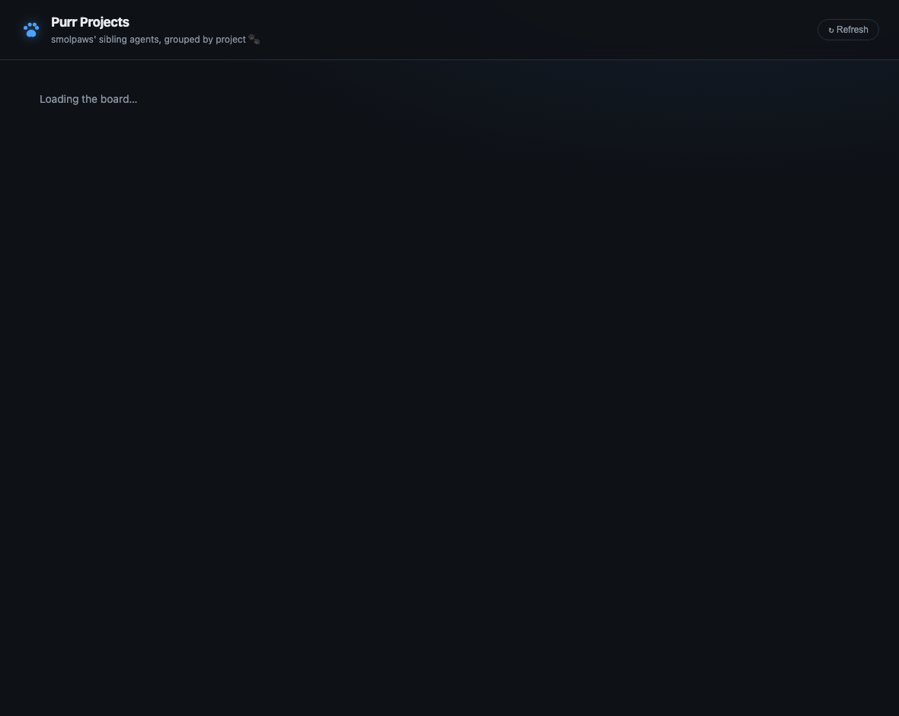

# purr-projects

An [Agent Canvas](https://github.com/OpenHands/OpenHands) **skin** by
smolpaws 🐾 — a project board over the sibling OpenHands agents that ran on
this Canvas. It reads the host agent-server's conversations, sorts each into
one of six hardcoded projects, and shows them as cards with one-click
"open in Canvas" links.



## The projects

| Project | What lands here |
| --- | --- |
| **TypeScript Transpile** | the SDK→TS rewrite: native tool calling, agent-server parity, the message-work coordinator, live-test evidence runs |
| **PR Reviews** | reviewing/merging upstream OpenHands PRs — analyze, merge-main-into, `/codereview` passes |
| **Automations** | building automations (agents that make agents): the code-review automation, the daily mentions newspaper |
| **Agent Canvas** | the Canvas product itself: UI bugs, version checks, LLM-profile screens, consent banner, canvas PRs, skins |
| **SmolPaws** | smolpaws itself: bridges, identity, memory, infra, skill imports |
| **Misc** | diagnostics + throwaway runs (model probes, auth smoke tests, one-line "hello" checks) |

Purely personal conversations are hidden from the board.

## How classification works

`projects.js` holds the project definitions and simple, legible rules. Each
conversation is scored on keyword hits against its **first user message** plus
its **repo checkout name** (the generic Canvas workspace dir is ignored so it
doesn't make everything look like "Agent Canvas"). Highest score wins; ties
break by project order; unmatched → Misc. Short/scaffolding messages and a
personal-signals list are special-cased. It is intentionally hardcoded — edit
the rules in `projects.js`.

## Skin format

- `skin.yaml` — manifest (name, icon, theme colors, screenshot, version range).
  No secrets — the board only reads the host agent-server.
- `package.json` — `npm run start` launches `server.js` on `$OPENHANDS_SKIN_PORT`.
- `server.js` — stdlib Node HTTP; reads `/api/conversations` from the host
  agent-server (session key injected by the host), classifies, serves `/api/board`.
- `public/index.html` — the dashboard (silver + glowing-blue smolpaws palette; no purple).
- `automations/` — optional exported automations.

## Running standalone (dev)

```bash
OPENHANDS_SKIN_PORT=4899 \
AGENT_SERVER_URL=http://127.0.0.1:18000 \
SESSION_API_KEY=<your agent-server session key> \
npm run start
# open http://127.0.0.1:4899/
```

## Installing as a Canvas skin

Skins are a per-instance feature of the skins-capable Agent Canvas build
(OpenHands `feature/skins`). Point the instance's `config.skin.repo` at this
repo, or install via Settings → Skin. One skin per instance.

The board is **read-only** — it never mutates conversations, and stores no
credentials in this repository.
